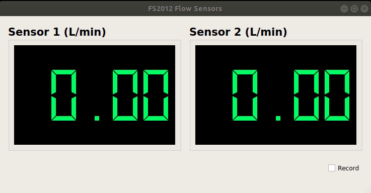
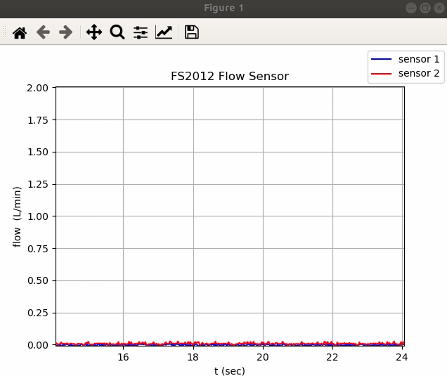

# FS2012 flow sensor  

Firmware, Python library, PyQt GUI for working with the FS2012 flow sensors. Supports only **Python 3**. For a Python 2-compatible version of the software, see the [original repo](https://github.com/willdickson/fs2012_flow_sensor). 

## Requirements

* [pyserial](https://pythonhosted.org/pyserial/)
* [pyqt5](https://pypi.org/project/PyQt5/)


## Installation

Navigate to the directory that houses `setup.py` and install in editable mode:
```bash
cd fs2012_flow_sensor/software/fs2012_flow_sensor
pip install -e .
```

## `DataReader` Example

The below code snippet can be found in `examples/data_reader_example.py`:

```python
import time
from fs2012_flow_sensor import DataReader

port = '/dev/ttyUSB0'
reader = DataReader(port)
reader.start()
for i in range(75):
    print(reader.get_data())
    time.sleep(0.1)
reader.stop()
```

## Running the `pyqt` GUI 
The script runs from anywhere, and outputs `flow_data.txt` in the current directory, if the "record" box is checked. Run with:

```bash
flow_sensor_app
```

The script can accept an argument that specifies the path to the uC port. This argument is defaulted to `/dev/ttyUSB0`. If the above command fails, check that `/dev/ttyUSB0` is the correct port. If not, specify it like so:

```bash
flow_sensor_app /dev/<my_port>
```



## Running the live plot
The script runs from anywhere, and outputs `flow_data.csv` in the current directory. Run with:
```bash
flow_sensor_live_plot
```

The script can accept an argument that specifies the path to the uC port. This argument is defaulted to `/dev/ttyUSB0`. If the above command fails, check that `/dev/ttyUSB0` is the correct port. If not, specify it like so:

```bash
flow_sensor_live_plot /dev/<my_port>
```

